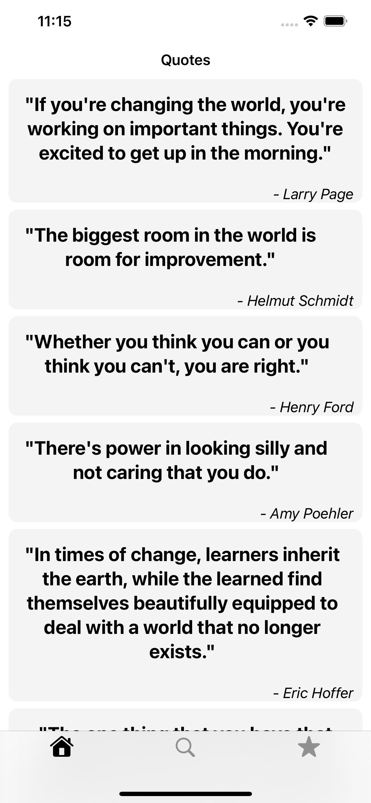
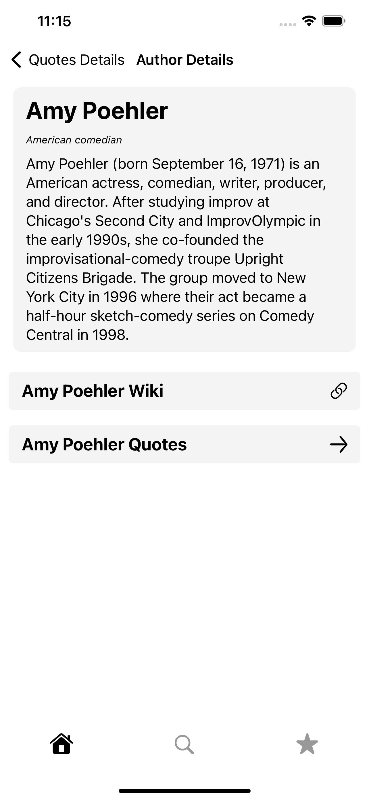
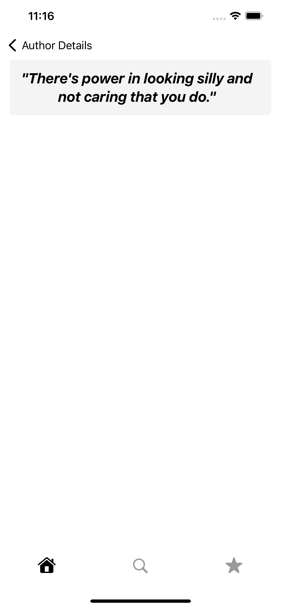
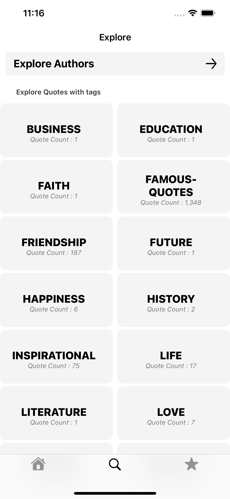
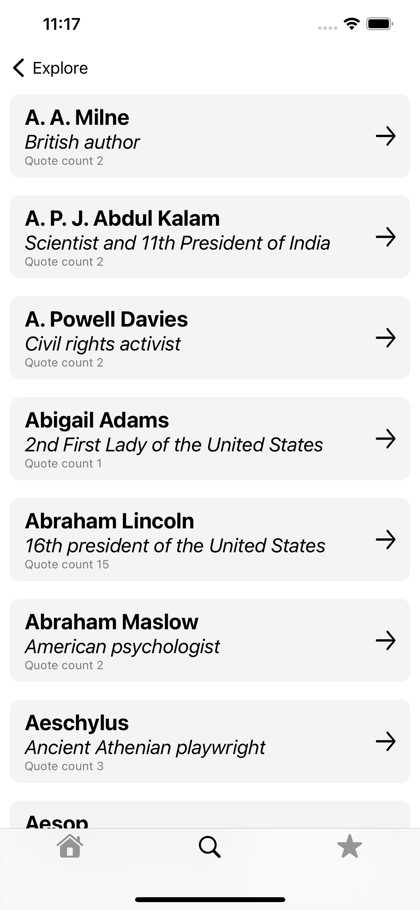
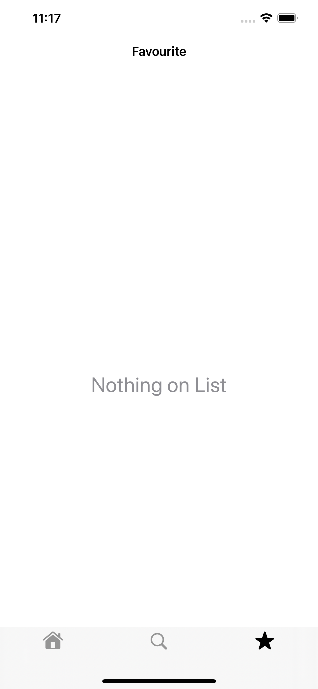

# Quotes
## Getting Started ##

1. git clone [https://github.com/singhbaidwan/Quotes](https://github.com/singhbaidwan/Quotes)  
2. cd Quotes. 
3. API used :-  https://github.com/lukePeavey/quotable#list-tags 
## Screenshots ##

<table>
<tr>
<td></td>
<td> </td>
<td></td>
</tr>
 
<tr>
<td></td>
<td> </td>
<td></td>
</tr>
   

<tr>
<td></td>
<td> </td>
<td> </td>
</tr>
 

</table>
